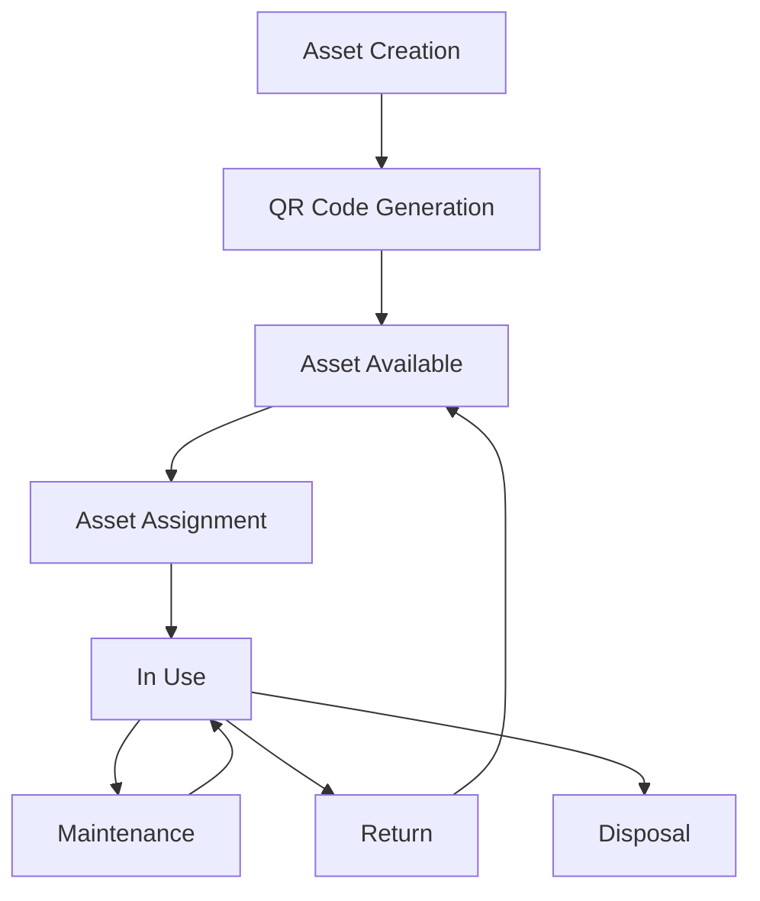
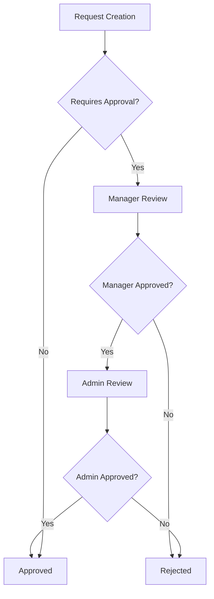
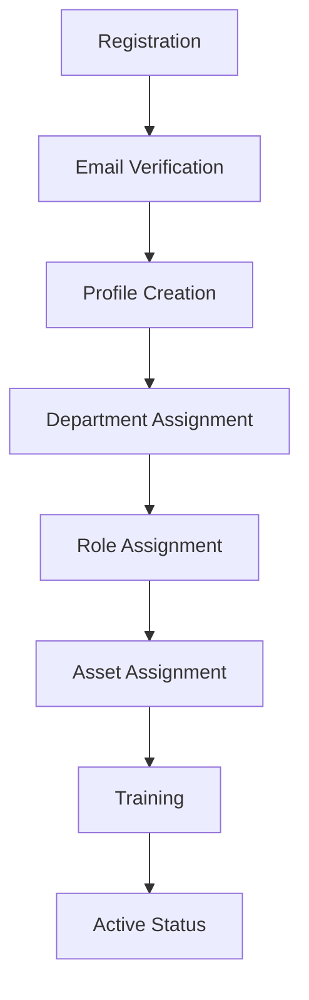
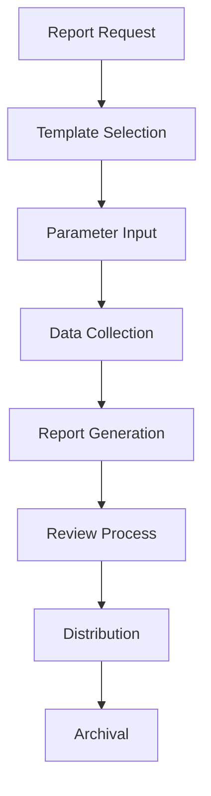
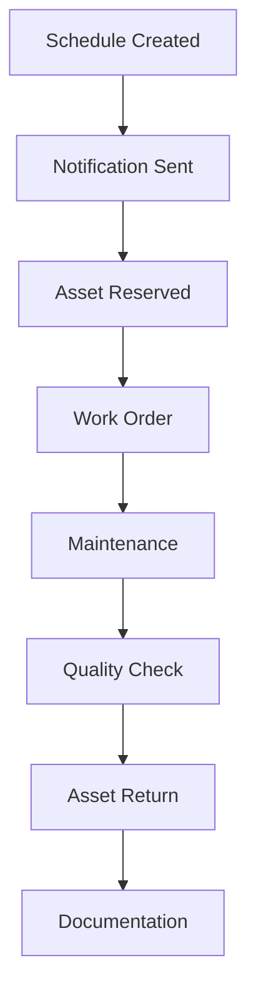
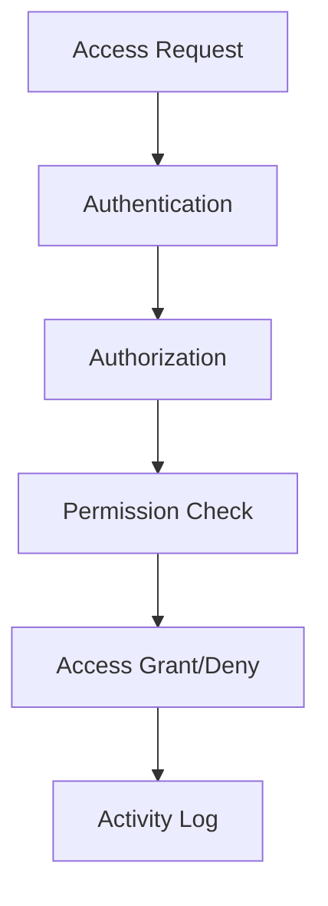
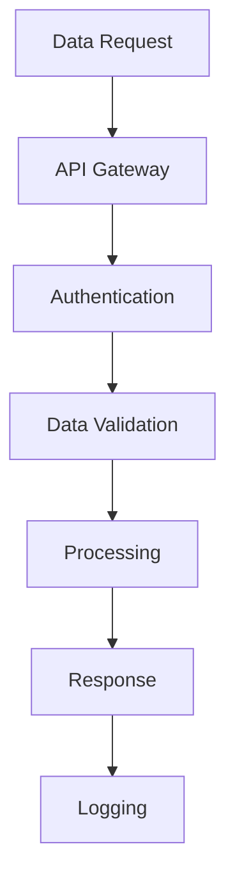
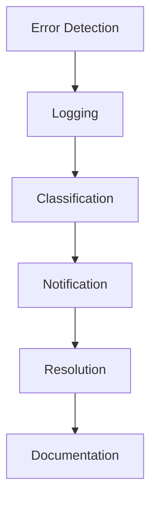

# System Workflows Documentation

## Asset Management Workflows

### Asset Lifecycle

1. **Asset Registration**
   - Asset details entered
   - QR code generated
   - Initial status set
   - Department assigned
   - Notifications sent

2. **Asset Assignment**
   - Request submitted
   - Manager approval
   - Asset status updated
   - User notified
   - Assignment logged

3. **Asset Maintenance**
   - Maintenance scheduled
   - Asset status updated
   - Work orders created
   - Costs tracked
   - History maintained

4. **Asset Disposal**
   - Disposal request
   - Value assessment
   - Approval workflow
   - Records archived
   - Asset decommissioned

## Request Management Workflows

### Request Processing

1. **Request Creation**
   - User submits request
   - Request ID generated
   - Initial validation
   - Notifications sent
   - Workflow initiated

2. **Approval Process**
   - Manager review
   - Admin approval (if needed)
   - Status updates
   - Email notifications
   - Audit trail maintained

3. **Request Fulfillment**
   - Asset assignment
   - Status updates
   - User notifications
   - Documentation
   - Completion tracking

## User Management Workflows

### User Onboarding

1. **Registration Process**
   - User registration
   - Email verification
   - Profile completion
   - Role assignment
   - Department setup

2. **Role Management**
   - Role assignment
   - Permission setup
   - Department access
   - Asset permissions
   - System access

3. **User Deactivation**
   - Request received
   - Assets returned
   - Access revoked
   - Records archived
   - Final status update

## Report Generation Workflows

### Report Creation

1. **Report Configuration**
   - Template selection
   - Parameter setup
   - Data source selection
   - Format choice
   - Schedule setup

2. **Generation Process**
   - Data collection
   - Processing
   - Formatting
   - Validation
   - Distribution

3. **Report Distribution**
   - Access control
   - Email distribution
   - Archive storage
   - Audit logging
   - Feedback collection

## Maintenance Management Workflows

### Scheduled Maintenance

1. **Maintenance Scheduling**
   - Schedule creation
   - Resource allocation
   - Notification system
   - Work orders
   - Cost tracking

2. **Maintenance Execution**
   - Asset preparation
   - Work performed
   - Parts tracking
   - Time logging
   - Quality checks

3. **Maintenance Completion**
   - Work verification
   - Documentation
   - Asset return
   - Status update
   - History update

## Security Workflows

### Access Control

1. **Authentication Process**
   - Credentials validation
   - Token generation
   - Session management
   - Activity logging
   - Security checks

2. **Authorization Flow**
   - Role verification
   - Permission check
   - Access control
   - Audit logging
   - Security monitoring

## Integration Workflows

### External System Integration

1. **Data Exchange**
   - Request validation
   - Data transformation
   - Security checks
   - Response handling
   - Error management

2. **Synchronization**
   - Data validation
   - Conflict resolution
   - Error handling
   - Status tracking
   - Audit logging

## Error Handling Workflows

### Error Management

1. **Error Processing**
   - Error detection
   - Classification
   - Priority assignment
   - Notification
   - Resolution tracking

2. **Recovery Process**
   - Error analysis
   - Recovery steps
   - Validation
   - Documentation
   - Prevention measures 